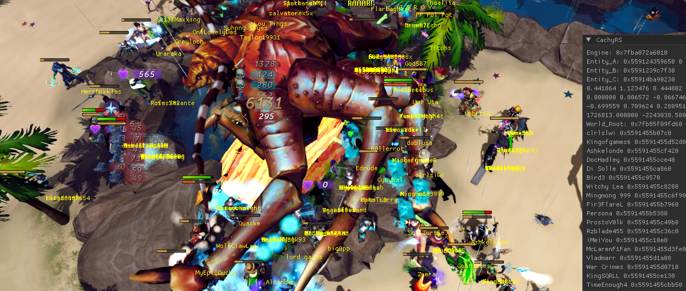
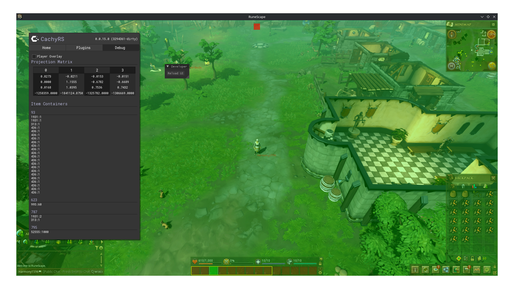

# CachyRS
A third party client for RS3 (and eventually, OSRS.)

**THIS PROJECT IS A WIP AND ACTIVELY UNDER DEVELOPMENT**
## Compiling
### Linux
`git clone https://github.com/csmoke66/CachyRS`  
`cd CachyRS`  
`chmod +x build.sh`  
`./build.sh`  
## Usage
1. Run the native RS3 linux client
2. Run `bin/injector` with root permissions

This will load the mod into the game client, and automatically enable everything.



## Project Structure
### updater
This is responsible for generating the headers that map to game structures in memory.  
  
To generate new headers simply run `./updater` with rs2client in the same directory.
### mod
This is the shared library that's injected into rs2client to provide all of the client functionality. It relies on headers generated by updater to interact with the game binary.
### injector
This is a simple .so injector that was modified from another repository I forget the name of. It has a bug and fails sometimes.
## Feature Requests
I expect people to request things like Windows support, or language bindings. This is currently outside of the scope of the project as I only run Linux on my machines. I will happily work with people to add support and accept pull requests.  
  
All Linux specific APIs have multi-platform stubs:
```c
#ifdef __linux__
// linux code
#else
UNSUPPORTED_OS();
#endif
```
C++ STL usage is used wherever possible to reduce reliance on OS specific APIs. Adding support for another system should just be adding additional macros.