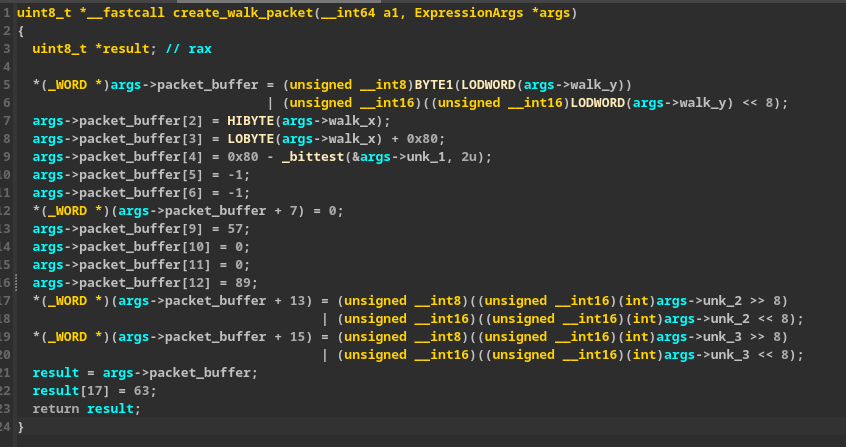

This is currently just a POC for extracting and recompiling clean packet expressions. This allows us to create our own packets entirely, regardless of the randomized obfuscation applied.  
  
It is hard-coded to just the walking packet handler for now.  
  
